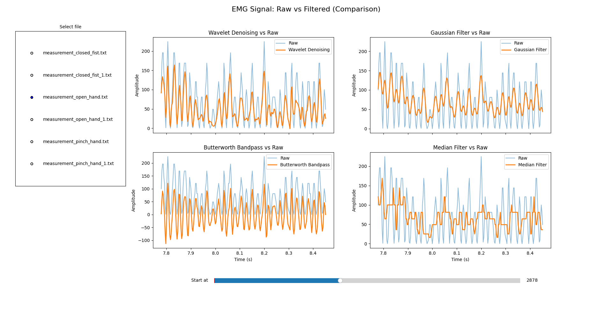

<h1 align="center">Raw EMG Data Filters Visualizer</h1>

## Preface

This project takes EMG data measurements from <a href="https://www.dfrobot.com/product-1661.html">Gravity: Analog EMG Sensor</a> and applies the following filtering techniques in order to tune the data for further processing:

1. Wavelet Transform (WT) Denoising
2. Gaussian Smoothing Filter (GSF)
3. Butterworth Bandpass Filter
4. Median Filtering

> **Note**
> 
> The EMG sensor used is **not** a medical device (as noted by DFRobot) and is subjected to background disturbances. We also make assumption that the data is spaced by about 370 milliseconds as the Python date time measurements may be unreliable during serial input monitoring.

## Usage

First, ensure that Python is installed and in PATH. You can then proceed by installing the required dependencies:

```sh
$ pip install -r requirements.txt
```

Then, to run the project, run the following command:

```sh
$ python -m emg_visualizer.visualizer
```

By default, it will scan the [EMG data directory](./emg_data/) and list out the selection.

## Screenshots



<center><i>In the above image, we can see a <code>matplotlib</code> interface that shows a selection of files as well as a visualization of data and applied filters. The sliding window is of the length 250.</i></center>

<center><i>These settings can be changed through code modifications.</i></center>